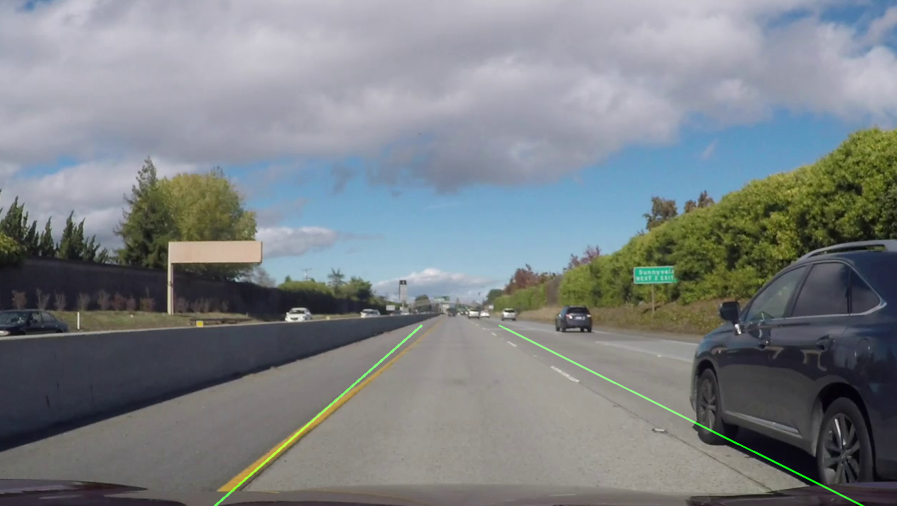
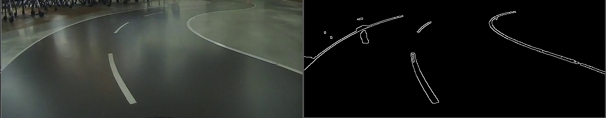
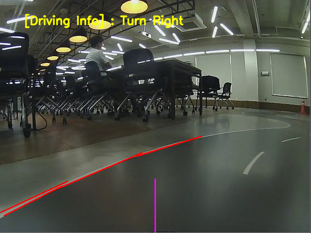
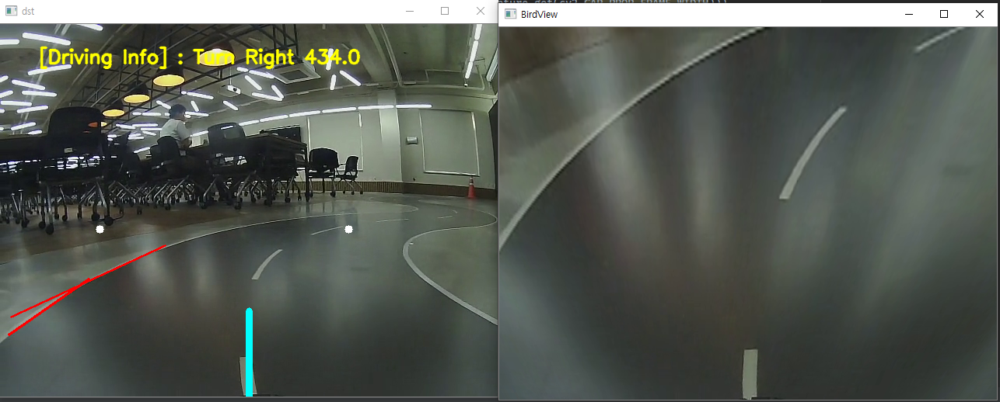
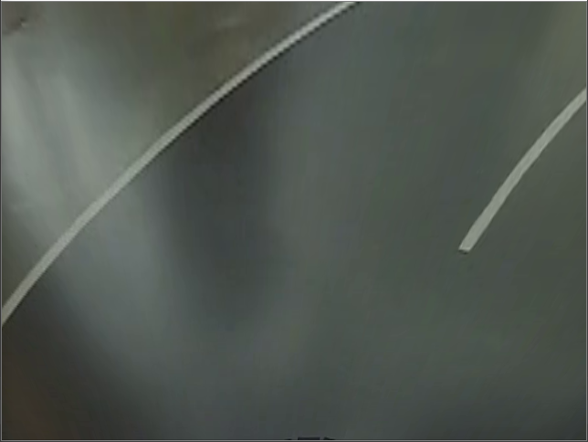

# Autonomus-Vehicle

자율주행 영상처리 모듈 개발

## Description

- 차선 인식 모듈
- 장애물 인식 모듈
- HW 제어, 시리얼 통신 모듈 구현

## Env

- Python3.6
- Tensorflow 2.1.0
- Keras
- OpenCV 4.3.0

```buildoutcfg
pip install tensorflow
pip install keras
pip install opencv-python
```

## Schedule

- [X] 전처리 과정을 통해 왜곡된 직선을 직선 형태로 수정. 대표직선 검출 [07.12]
- [X] ROI를 바탕으로 차선 인식 Region 외의 Thresholding적용 [07.12]
- [X] 차선 색상 마스킹[07.27]
- [X] 원근 변환을 통해 전방 도로이미지를 변환.[07.28]
- [ ] Sliding Window Searching을 통해 곡선 차선의 인식오차 최소화
- [ ] 최종적으로 인식된 차선을 바탕으로 인식결과를 표시함.
- [ ] 실질적 주행을 위해 조명, 바닥면 상태를 고려할 수 있는 머신러닝 모델적용
- [ ] Object Recognition ML Model Load(YOLO V3)
- [ ] Traffic Sign Recognition Model Load(YOLO V3)
- [ ] HW Control Sign Generate
- [ ] 하드웨어-영상처리 모듈간 통신 구현

## Revision History

- [20.07.12] 영상처리모듈 : ROI, Hough 변환을 통해 전방 도로이미지에 대한 대표 직선 검출 구현



- [20.07.27] 전방 도로이미지에 대해 흰색 Masking작업



- [20.07.28] Guide Line 기준 direction 결정 모듈 구현



- [20.07.28] 전방 도로 bird view 구현

