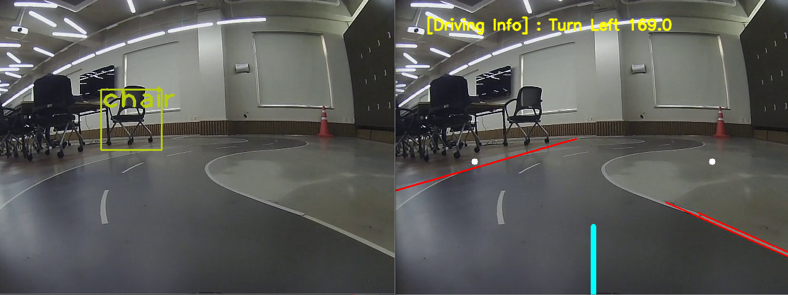

# LaneRecognition Description 
- CameraCalibration을 통한 직선 왜곡 보정
```
참고 [https://docs.opencv.org/3.4.3/dc/dbb/tutorial_py_calibration.html]
```
- [X] 전처리 과정을 통해 왜곡된 직선을 직선 형태로 수정
- [X] ROI를 바탕으로 차선 인식 Region 외의 Thresholding적용
- [X] 차선 색상 마스킹
- [X] 원근 변환을 통해 전방 도로이미지를 변환. 
- [ ] Sliding Window Searching을 통해 곡선 차선의 인식오차 최소화
- [ ] 최종적으로 인식된 차선을 바탕으로 인식결과를 표시함.
- [ ] 실질적 주행을 위해 조명, 바닥면 상태를 고려할 수 있는 머신러닝 모델적용

---

# Obstacle Recognition

- [X] Object Recognition ML Model Load(Yolov3-tiny Model 적용, 신뢰도 0.5기준 object detection) [07.28]



---
# Traffic Sign Recognition
- 추가예정
---
## Revision History
- [20.07.12] ROI, Hough 변환을 통해 전방 도로이미지에 대한 대표 직선 검출


- [20.07.27] 전방 도로이미지에 대해 흰색 Masking작업


- [20.07.28] Guide Line 기준 direction 결정 모듈 구현


- [20.07.28] 전방 도로 bird view 구현

